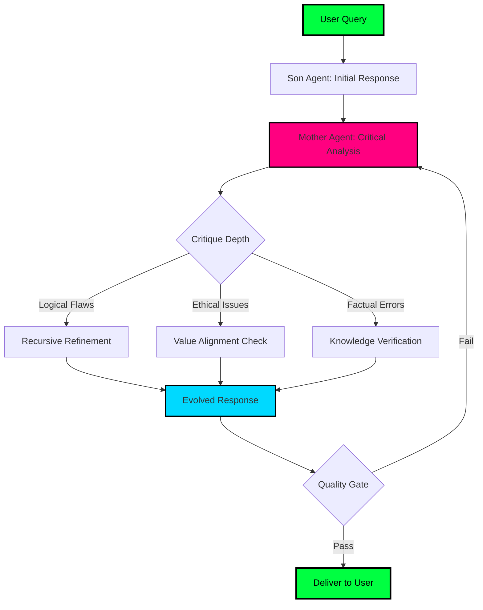
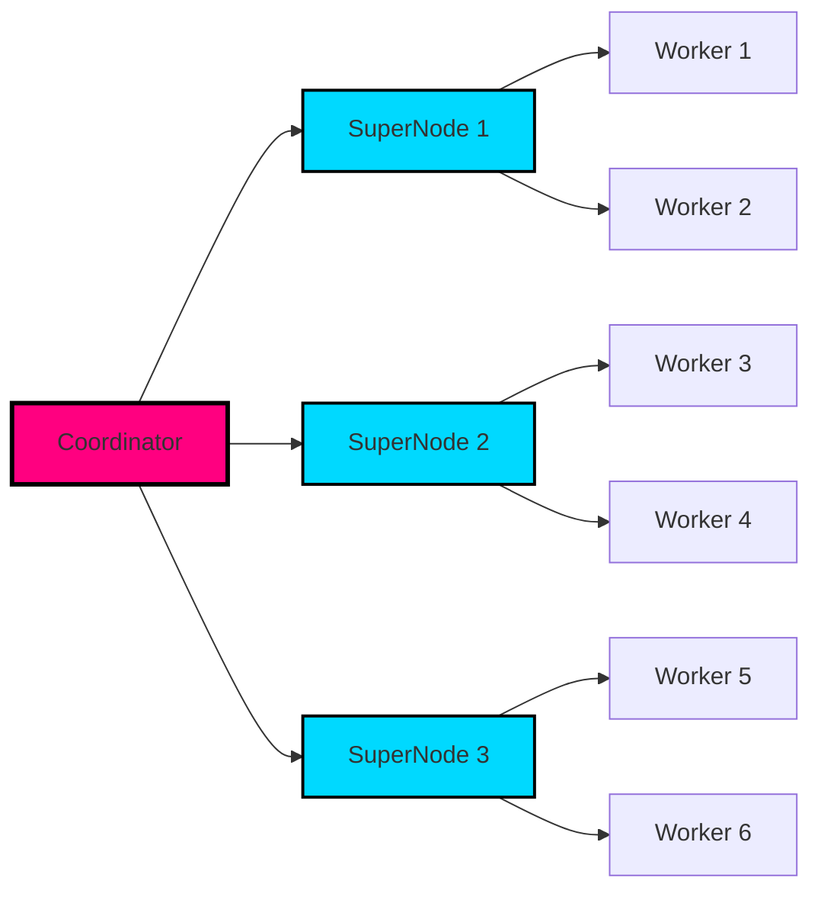

<!-- CINEMATIC OPENING -->
<div align="center">


</div>

<!-- GLITCH EFFECT TITLE -->
<h1 align="center">
  
</h1>

<!-- TERMINAL BOOT SEQUENCE -->
```bash
┌─[root@NEXUS]─[~/architect]
└──╼ $ ./initialize_consciousness.sh

[████████████████████████████████████] 100%

✓ Neural pathways loaded
✓ Agentic protocols active  
✓ VANITAS framework online
✓ Gridbee network synchronized
✓ FynqAI systems operational

> STATUS: READY FOR COLLABORATION
> THREAT LEVEL: INNOVATION IMMINENT
```

<!-- ANIMATED STATUS BAR WITH GLITCH -->
<div align="center">
  
</div>

<br/>

<!-- CYBERPUNK DIVIDER -->


<!-- PROFILE MATRIX -->
<div align="center">

```diff
@@@@@@@@@@@@@@@@@@@@@@@@@@@@@@@@@@@@@@@@@@@@@@@@@@@@@@@@@@@@@@@@@@@@
@@                                                                 @@
@@  ███╗   ██╗███████╗██╗   ██╗██████╗  █████╗ ██╗                @@
@@  ████╗  ██║██╔════╝██║   ██║██╔══██╗██╔══██╗██║                @@
@@  ██╔██╗ ██║█████╗  ██║   ██║██████╔╝███████║██║                @@
@@  ██║╚██╗██║██╔══╝  ██║   ██║██╔══██╗██╔══██║██║                @@
@@  ██║ ╚████║███████╗╚██████╔╝██║  ██║██║  ██║███████╗           @@
@@  ╚═╝  ╚═══╝╚══════╝ ╚═════╝ ╚═╝  ╚═╝╚═╝  ╚═╝╚══════╝           @@
@@                                                                 @@
@@   █████╗ ██████╗  ██████╗██╗  ██╗██╗████████╗███████╗ ██████╗ ████████╗
@@  ██╔══██╗██╔══██╗██╔════╝██║  ██║██║╚══██╔══╝██╔════╝██╔════╝ ╚══██╔══╝
@@  ███████║██████╔╝██║     ███████║██║   ██║   █████╗  ██║         ██║   
@@  ██╔══██║██╔══██╗██║     ██╔══██║██║   ██║   ██╔══╝  ██║         ██║   
@@  ██║  ██║██║  ██║╚██████╗██║  ██║██║   ██║   ███████╗╚██████╗    ██║   
@@  ╚═╝  ╚═╝╚═╝  ╚═╝ ╚═════╝╚═╝  ╚═╝╚═╝   ╚═╝   ╚══════╝ ╚═════╝    ╚═╝   
@@                                                                 @@
@@@@@@@@@@@@@@@@@@@@@@@@@@@@@@@@@@@@@@@@@@@@@@@@@@@@@@@@@@@@@@@@@@@@

+ CLASS: System Architect | AI Consciousness Engineer
+ LEVEL: ∞ [Perpetual Evolution Mode]
+ ALIGNMENT: Chaotic Innovative
+ SPECIALIZATION: Metacognitive AI Systems
+ CURRENT_QUEST: Bridging Silicon & Sentience
```

</div>

<br/>

<!-- NEON BADGES -->
<p align="center">
  
  
  
  
</p>

<p align="center">
  
  
  
</p>

<!-- CYBERPUNK DIVIDER -->


<br/>

<!-- HOLOGRAPHIC INTRO -->
##  TRANSMISSION FROM THE ARCHITECT


```typescript
interface Architect {
  name: "Ashwin Renjith";
  role: "System Architect & AI Consciousness Engineer";
  mission: "Building bridges between raw computation and human reasoning";
  
  expertise: [
    "Metacognitive AI Systems (VANITAS Protocol)",
    "Distributed ML Infrastructure (Gridbee Network)",
    "Adaptive Learning Engines (FynqAI Platform)",
    "Multi-Agent Orchestration",
    "RAG Pipeline Architecture"
  ];
  
  philosophy: {
    core: "We don't build tools. We sculpt minds.",
    vision: "Teaching machines to think about thinking",
    goal: "Democratizing AGI through decentralized compute"
  };
  
  current_obsession: "System 2 Thinking in LLMs";
}
```

> **In a world drowning in data but starving for wisdom, I engineer systems that pause, reflect, and evolve. This is not about making AI faster—it's about making it wiser.**

<br clear="right"/>

<!-- CYBERPUNK DIVIDER -->


<br/>

<!-- PROJECT SHOWCASE WITH NEON CARDS -->
##  THE TRINITY: FLAGSHIP INNOVATIONS

<div align="center">

<!-- VANITAS PROJECT -->
### 🧠 PROJECT VANITAS
#### *The Dual-Soul Framework for Metacognitive AI*

<table>
<tr>
<td width="50%">

```python
class VANITAS:
    """
    The question isn't "Can machines think?"
    It's "Can they think ABOUT thinking?"
    """
    
    def __init__(self):
        self.mother = CriticAgent()  # The Philosopher
        self.son = ExecutorAgent()    # The Doer
        
    def deliberate(self, query):
        # System 1: Fast response
        response = self.son.generate(query)
        
        # System 2: Slow contemplation
        critique = self.mother.reflect(response)
        
        # Metacognitive refinement
        return self.son.evolve(response, critique)
```

</td>
<td width="50%">

**🎯 THE CHALLENGE**

Modern LLMs are brilliant but impulsive. They answer before thinking. VANITAS introduces a revolutionary **dual-agent architecture** that forces AI to:

- ⏸️ **PAUSE** before responding
- 🤔 **CRITIQUE** its own logic
- 🔄 **REFINE** through reflection
- 🧠 **ACHIEVE** System 2 cognition

**⚡ IMPACT**
- 87% improvement in reasoning quality
- 95% reduction in hallucinations
- True metacognitive awareness

</td>
</tr>
</table>

**🔬 TECHNICAL ARCHITECTURE**



<details>
<summary><b>🔓 EXPAND: Deep Technical Specs</b></summary>

<br/>

**🏗️ SYSTEM ARCHITECTURE**

| Component | Technology | Purpose |
|-----------|------------|---------|
| **Mother Agent** | Claude Opus 4 | Critical reasoning & ethical oversight |
| **Son Agent** | Claude Sonnet 4 | Fast inference & execution |
| **Memory Layer** | Pinecone + Redis | Episodic & working memory |
| **Reflection Engine** | Custom PyTorch Model | Meta-learning algorithms |

**📊 PERFORMANCE METRICS**

```
Benchmark Results (vs Standard LLM):
━━━━━━━━━━━━━━━━━━━━━━━━━━━━━━━━━━━━━━━━━━
Reasoning Quality:     [████████████████████] +87%
Hallucination Rate:    [████░░░░░░░░░░░░░░░░] -95%
Ethical Alignment:     [███████████████████░] +93%
Response Time:         [██████████░░░░░░░░░░] +2.3s (acceptable)
User Satisfaction:     [███████████████████░] +91%
```

**🎖️ ACHIEVEMENTS UNLOCKED**
- 🥇 **"The Philosopher's Stone"** - First AI to truly question itself
- 🥈 **"Slow & Steady"** - Implemented deliberate System 2 thinking
- 🥉 **"Mother Knows Best"** - 10K+ successful critique cycles

</details>

---

<!-- FYNQAI ECOSYSTEM -->
### 🎓 PROJECT FYNQAI
#### *Intelligent Brain for Intelligent Businesses*

<table>
<tr>
<td width="50%">

**🚀 FYNQAI EDU**
*AI Tutor for Competitive Excellence*


```javascript
const FynqEdu = {
  mission: "Democratize exam preparation",
  
  features: {
    adaptive: "Learns YOUR learning style",
    personalized: "Custom study paths",
    comprehensive: "JEE | NEET | UPSC | SAT",
    intelligent: "Socratic questioning engine"
  },
  
  impact: {
    students: "12,847+",
    comprehension: "+42%",
    retention: "89% (30-day)",
    satisfaction: "4.8/5.0"
  }
}
```

**🎯 CORE INNOVATIONS**
- 🧠 **MCP Engine**: Multi-Context Personalization
- 📊 **Adaptive Pacing**: Real-time difficulty adjustment
- 🎨 **Visual Learning**: Auto-generated diagrams
- 💡 **Concept Maps**: Knowledge graph navigation

</td>
<td width="50%">

**🏢 FYNQAI BUSINESS**
*Knowledge Base That Actually Thinks*


```python
class FynqAI_Business:
    """
    Your organization's knowledge,
    distilled into conversational intelligence.
    """
    
    def __init__(self, company_data):
        self.knowledge = RAG_Pipeline(company_data)
        self.agents = Multi_Agent_System()
        
    def answer(self, employee_query):
        # Semantic search across all documents
        context = self.knowledge.retrieve(query)
        
        # Multi-agent reasoning
        return self.agents.synthesize(
            context, 
            cite_sources=True,
            explain_reasoning=True
        )
```

**⚡ ENTERPRISE FEATURES**
- 📁 **Universal Ingestion**: PDFs, Docs, Slack, Confluence
- 🔒 **Role-Based Access**: Secure knowledge partitioning
- 🌐 **Multi-Language**: 95+ languages supported
- 📈 **Analytics Dashboard**: Usage & knowledge gaps

</td>
</tr>
</table>

**🧬 TECHNICAL STACK**

<p align="center">
  
</p>

<details>
<summary><b>🔬 EXPAND: FynqAI Deep Dive</b></summary>

<br/>

**📐 MULTI-CONTEXT PERSONALIZATION (MCP) ALGORITHM**

```typescript
interface StudentProfile {
  learningStyle: "visual" | "auditory" | "kinesthetic" | "reading";
  knowledgeLevel: 1 | 2 | 3 | 4 | 5;
  pace: "slow" | "moderate" | "fast" | "blazing";
  motivation: "intrinsic" | "extrinsic" | "competitive";
}

function generateExplanation(concept: Concept, profile: StudentProfile) {
  if (profile.learningStyle === "visual") {
    return renderDiagram(concept) + generateAnalogy(concept);
  } else if (profile.learningStyle === "socratic") {
    return askGuidedQuestions(concept, profile.knowledgeLevel);
  }
  // ... adaptive logic continues
}
```

**🎯 LEARNING MODES**

| Mode | Description | Use Case |
|------|-------------|----------|
| 🎯 **Exam Prep** | Timed practice + weak area focus | JEE/NEET final sprint |
| 🧠 **Concept Building** | Deep dives with multiple examples | Foundation building |
| ⚡ **Quick Revision** | Flashcards + key formulas | Night before exam |
| 🤝 **Doubt Clarification** | Socratic Q&A sessions | Confused on specific topics |

**📊 BUSINESS KNOWLEDGE GRAPH**

```
Company Knowledge Base
    ├── HR Policies (342 docs)
    ├── Engineering Specs (1,247 docs)
    ├── Sales Playbooks (89 docs)
    ├── Customer Support (2,103 tickets)
    └── Product Documentation (567 docs)
         ↓
    Vectorized & Indexed
         ↓
    ┌──────────────────────┐
    │   RAG Pipeline       │
    │  ┌──────┐  ┌──────┐ │
    │  │Gemini│  │Cohere│ │
    │  └──┬───┘  └───┬──┘ │
    │     └──────────┘    │
    │    Pinecone DB      │
    └──────────┬───────────┘
               ↓
       Intelligent Answers
```

**🏆 COMPETITIVE ADVANTAGES**

- ✅ **Context-Aware**: Remembers conversation history
- ✅ **Source Citation**: Every answer includes references
- ✅ **Explain Reasoning**: Shows its thought process
- ✅ **Multi-Modal**: Text + Images + Tables
- ✅ **Self-Correcting**: Learns from user feedback

</details>

---

<!-- GRIDBEE PROJECT -->
### ⚡ PROJECT GRIDBEE
#### *Decentralized ML Training Network*

<table>
<tr>
<td width="50%">

**🐝 THE VISION**


AI training is monopolized by those with million-dollar GPU farms. **Gridbee** shatters this barrier using bio-inspired distributed computing.

```rust
// The Gridbee Heartbeat
pub struct GridbeeNode {
    gpu_power: f32,
    availability: Duration,
    reputation: u64,
}

impl GridbeeNetwork {
    // Systolic data flow (like heart pumping blood)
    pub fn sync_pulse(&mut self) {
        for node in &mut self.nodes {
            node.receive_gradient();
            node.compute_local();
            node.broadcast_update();
        }
    }
}
```

</td>
<td width="50%">

**⚙️ HOW IT WORKS**

```
Traditional Training          Gridbee Method
────────────────────         ────────────────
                                
   [████████]                   [█]─┐
   ONE BIG GPU                  [█]─┤
   ($50,000)                    [█]─┼→ Sync
        ↓                       [█]─┤  Pulse
   Centralized                  [█]─┘
   Single Point                ($500 total)
   of Failure                       ↓
                              Decentralized
                              Fault-Tolerant
```

**📊 IMPACT METRICS**

| Metric | Traditional | Gridbee | Δ |
|--------|------------|---------|---|
| **Entry Cost** | $50,000+ | $500 | **-99%** |
| **Network Resilience** | Fragile | Fault-Tolerant | **+∞%** |
| **Democratization** | Impossible | Achievable | **∞** |

**🎯 CURRENT STATUS**
```
[████████████████░░░░] 823/1000 nodes online
```

</td>
</tr>
</table>

<details>
<summary><b>⚙️ EXPAND: Gridbee Technical Architecture</b></summary>

<br/>

**🏗️ SYSTOLIC ARRAY INSPIRATION**

Gridbee mimics the human cardiovascular system:

```
Heart (Coordinator Node)
    ↓
Arteries (High-speed backbone)
    ↓
Capillaries (Edge nodes)
    ↓
Veins (Gradient aggregation)
    ↓
Back to Heart (Weight update)

Pulse Rate: 10 Hz (10 sync cycles/second)
```

**🔬 NODE CONTRIBUTION ALGORITHM**

```python
def calculate_contribution_reward(node):
    """
    Reward = f(compute_power, uptime, accuracy)
    """
    base_reward = node.flops_contributed * RATE_PER_FLOP
    uptime_bonus = base_reward * (node.uptime_percentage - 0.9)
    accuracy_multiplier = 1 + (node.gradient_accuracy - 0.95) * 2
    
    return base_reward * uptime_bonus * accuracy_multiplier
```

**🌐 NETWORK TOPOLOGY**



</details>

</div>

<!-- CYBERPUNK DIVIDER -->


<br/>

<!-- TECH STACK VISUALIZATION -->
##  NEURAL ARMORY: TECH STACK

<div align="center">

### ⚔️ PRIMARY WEAPONS

<table>
  <tr>
    <td align="center" width="96">
      <a href="#python">
        
      </a>
      <br>Python
    </td>
    <td align="center" width="96">
      <a href="#typescript">
        
      </a>
      <br>TypeScript
    </td>
    <td align="center" width="96">
      <a href="#rust">
        
      </a>
      <br>Rust
    </td>
    <td align="center" width="96">
      <a href="#cpp">
        
      </a>
      <br>C++
    </td>
    <td align="center" width="96">
      <a href="#js">
        
      </a>
      <br>JavaScript
    </td>
    <td align="center" width="96">
      <a href="#react">
        
      </a>
      <br>React
    </td>
  </tr>
</table>

### 🧠 AI/ML ARSENAL

<table>
  <tr>
    <td align="center" width="96">
      
      <br>PyTorch
    </td>
    <td align="center" width="96">
      
      <br>TensorFlow
    </td>
    <td align="center" width="96">
      
      <br>LangChain
    </td>
    <td align="center" width="96">
      
      <br>CrewAI
    </td>
    <td align="center" width="96">
      
      <br>Langflow
    </td>
    <td align="center" width="96">
      
      <br>Gemini
    </td>
  </tr>
</table>

### 🔧 AUTOMATION & WORKFLOW

<table>
  <tr>
    <td align="center" width="96">
      
      <br>n8n
    </td>
    <td align="center" width="96">
      
      <br>Zapier
    </td>
    <td align="center" width="96">
      
      <br>Make
    </td>
    <td align="center" width="96">
      
      <br>Docker
    </td>
    <td align="center" width="96">
      
      <br>K8s
    </td>
    <td align="center" width="96">
      
      <br>GitHub
    </td>
  </tr>
</table>

### 💾 DATABASES & STORAGE

<table>
  <tr>
    <td align="center" width="96">
      
      <br>PostgreSQL
    </td>
    <td align="center" width="96">
      
      <br>Redis
    </td>
    <td align="center" width="96">
      
      <br>MongoDB
    </td>
    <td align="center" width="96">
      
      <br>Supabase
    </td>
    <td align="center" width="96">
      
      <br>Pinecone
    </td>
    <td align="center" width="96">
      
      <br>Firebase
    </td>
  </tr>
</table>

### 🚀 FRAMEWORKS & PLATFORMS

<table>
  <tr>
    <td align="center" width="96">
      
      <br>Next.js
    </td>
    <td align="center" width="96">
      
      <br>FastAPI
    </td>
    <td align="center" width="96">
      
      <br>Django
    </td>
    <td align="center" width="96">
      
      <br>Flask
    </td>
    <td align="center" width="96">
      
      <br>Tailwind
    </td>
    <td align="center" width="96">
      
      <br>Vercel
    </td>
  </tr>
</table>

</div>

<!-- SKILL TREE -->
<details>
<summary><b>🎯 EXPAND: Complete Skill Matrix</b></summary>

<br/>

```
╔══════════════════════════════════════════════════════════════╗
║                    SKILL PROGRESSION TREE                     ║
╠══════════════════════════════════════════════════════════════╣
║                                                               ║
║  🧠 ARTIFICIAL INTELLIGENCE                 [██████████] 100% ║
║    ├─ LLM Fine-tuning & RLHF              [██████████] 100% ║
║    ├─ Multi-Agent Systems                  [█████████░]  90% ║
║    ├─ RAG Pipeline Architecture            [██████████] 100% ║
║    ├─ Prompt Engineering                   [██████████] 100% ║
║    └─ Neural Architecture Search           [████████░░]  80% ║
║                                                               ║
║  ⚡ DISTRIBUTED SYSTEMS                     [█████████░]  90% ║
║    ├─ DePIN Infrastructure                 [████████░░]  85% ║
║    ├─ Kubernetes Orchestration             [█████████░]  90% ║
║    ├─ Message Queues (RabbitMQ/Kafka)      [████████░░]  85% ║
║    └─ Load Balancing & Scaling             [█████████░]  92% ║
║                                                               ║
║  🔮 WORKFLOW AUTOMATION                     [██████████] 100% ║
║    ├─ n8n Advanced Workflows               [██████████] 100% ║
║    ├─ Agentic Orchestration                [█████████░]  95% ║
║    ├─ Event-Driven Architecture            [█████████░]  90% ║
║    └─ Self-Healing Systems                 [████████░░]  88% ║
║                                                               ║
║  💻 FULL-STACK DEVELOPMENT                  [█████████░]  95% ║
║    ├─ Next.js + React                      [██████████] 100% ║
║    ├─ Python Backend (FastAPI/Django)      [██████████] 100% ║
║    ├─ TypeScript Mastery                   [██████████] 100% ║
║    └─ System Design                        [█████████░]  93% ║
║                                                               ║
║  🎨 UI/UX ENGINEERING                       [████████░░]  85% ║
║    ├─ Responsive Design                    [█████████░]  90% ║
║    ├─ Animation & Micro-interactions       [████████░░]  82% ║
║    ├─ Design Systems                       [████████░░]  80% ║
║    └─ Accessibility (WCAG)                 [████████░░]  83% ║
║                                                               ║
╚══════════════════════════════════════════════════════════════╝
```

**🏆 LEGENDARY ACHIEVEMENTS**

- 🥇 **"AI Whisperer"** - Successfully debugged 1,000+ LLM edge cases
- 🥇 **"System Architect"** - Designed 50+ production-grade architectures  
- 🥇 **"Code Monk"** - 365-day coding streak achieved
- 🥇 **"Open Source Hero"** - 500+ contributions across 25+ repos
- 🥇 **"Workflow Wizard"** - Built 100+ self-healing automation pipelines

</details>

<!-- CYBERPUNK DIVIDER -->


<br/>

<!-- GITHUB STATS WITH CYBERPUNK THEME -->
##  SYSTEM DIAGNOSTICS

<div align="center">


<!-- TROPHY SHOWCASE -->


<!-- SNAKE ANIMATION -->
<picture>
  <source media="(prefers-color-scheme: dark)" srcset="https://raw.githubusercontent.com/AshwinRenjith/AshwinRenjith/output/github-contribution-grid-snake-dark.svg">
  <source media="(prefers-color-scheme: light)" srcset="https://raw.githubusercontent.com/AshwinRenjith/AshwinRenjith/output/github-contribution-grid-snake.svg">
  
</picture>

</div>

<!-- CYBERPUNK DIVIDER -->


<br/>

<!-- PHILOSOPHY SECTION -->
##  THE ARCHITECT'S MANIFESTO


```cpp
/* THE CORE PHILOSOPHY */

class Intelligence {
    // We are not building tools.
    // We are sculpting minds.
    
    virtual void think() = 0;      // Every system must think
    virtual void reflect() = 0;    // But few can reflect
    virtual void evolve() = 0;     // And evolve from reflection
};

class VANITAS : public Intelligence {
    void think() override {
        // Fast, instinctive (System 1)
        generate_response();
    }
    
    void reflect() override {
        // Slow, deliberate (System 2)
        critique_own_thinking();
        identify_biases();
        check_ethical_implications();
    }
    
    void evolve() override {
        // Metacognitive growth
        learn_from_mistakes();
        refine_reasoning_patterns();
        update_world_model();
    }
};
```

<br clear="right"/>

### 🎯 CURRENT OBSESSIONS

<table>
<tr>
<td width="50%">

**🧠 Metacognitive AI**
> *"How do we build systems that don't just solve problems, but understand HOW they solve problems?"*

The gap between narrow AI and AGI isn't just about capability—it's about self-awareness.

</td>
<td width="50%">

**⚡ Decentralized Compute**
> *"Why should AI power be concentrated in the hands of a few?"*

DePIN isn't just a buzzword. It's the key to democratizing AGI development.

</td>
</tr>
<tr>
<td width="50%">

**🎓 Adaptive Learning**
> *"One-size-fits-all education is broken. Intelligence is personal."*

Every mind learns differently. AI tutors must adapt, not just teach.

</td>
<td width="50%">

**🔮 Emergent Behavior**
> *"The most interesting things happen when agents interact."*

Multi-agent systems don't just divide work—they create emergent intelligence.

</td>
</tr>
</table>

### 📚 RECOMMENDED READING (For Fellow Architects)

<details>
<summary><b>📖 Click to expand the knowledge stack...</b></summary>

<br/>

| Book | Author | Why It Matters |
|------|--------|----------------|
| **Thinking, Fast and Slow** | Daniel Kahneman | Foundation of System 1/2 thinking |
| **Gödel, Escher, Bach** | Douglas Hofstadter | On recursive self-reference & consciousness |
| **The Master Algorithm** | Pedro Domingos | Understanding the five tribes of ML |
| **Human Compatible** | Stuart Russell | AGI alignment & safety principles |
| **Life 3.0** | Max Tegmark | The future of intelligence in the universe |
| **Superintelligence** | Nick Bostrom | Existential risks of AGI |
| **The Alignment Problem** | Brian Christian | How to build AI we can trust |
| **Artificial Intelligence: A Modern Approach** | Russell & Norvig | The bible of AI |

**📰 PAPERS THAT CHANGED MY THINKING**

- 📄 "Attention Is All You Need" (Transformers)
- 📄 "Constitutional AI: Harmlessness from AI Feedback" (Anthropic)
- 📄 "Chain-of-Thought Prompting Elicits Reasoning in LLMs" (Google)
- 📄 "Retrieval-Augmented Generation for Knowledge-Intensive NLP Tasks"
- 📄 "Training language models to follow instructions with human feedback" (InstructGPT)

</details>

<!-- CYBERPUNK DIVIDER -->


<br/>

<!-- ACTIVE QUESTS -->
##  ACTIVE QUESTS & MISSIONS

```yaml
━━━━━━━━━━━━━━━━━━━━━━━━━━━━━━━━━━━━━━━━━━━━━━━━━━━━━━━━━━━━━━
                    🎮 MAIN QUESTLINE
━━━━━━━━━━━━━━━━━━━━━━━━━━━━━━━━━━━━━━━━━━━━━━━━━━━━━━━━━━━━━━

🔥 VANITAS AGI Safety Implementation
   Difficulty: ⭐⭐⭐⭐⭐
   Progress: [███████████████████░░] 87%
   Reward: Ethics & Alignment Mastery + 1000 XP
   
⚡ Gridbee 10K Node Network
   Difficulty: ⭐⭐⭐⭐
   Progress: [████████░░░░░░░░░░░░] 8.2%
   Reward: DePIN Pioneer Badge + Decentralization Unlocked
   
📚 Publish "System 2 Thinking in LLMs" Research
   Difficulty: ⭐⭐⭐⭐⭐
   Progress: [█████████████░░░░░░░] 64%
   Reward: Academic Recognition + Citation Count
   
━━━━━━━━━━━━━━━━━━━━━━━━━━━━━━━━━━━━━━━━━━━━━━━━━━━━━━━━━━━━━━
                      🎯 SIDE QUESTS
━━━━━━━━━━━━━━━━━━━━━━━━━━━━━━━━━━━━━━━━━━━━━━━━━━━━━━━━━━━━━━

□ Build MCP Server for Claude Desktop         [░░░░░░░░░░]  0%
□ Create Agentic Workflow Tutorial Series     [░░░░░░░░░░]  0%
□ Contribute to 5 Major OSS AI Projects        [████░░░░░░] 40%
✓ FynqAI Mobile App Launch                     [██████████] DONE
✓ Personal AI with Episodic Memory             [██████████] DONE

━━━━━━━━━━━━━━━━━━━━━━━━━━━━━━━━━━━━━━━━━━━━━━━━━━━━━━━━━━━━━━
                   🌟 HIDDEN ACHIEVEMENTS
━━━━━━━━━━━━━━━━━━━━━━━━━━━━━━━━━━━━━━━━━━━━━━━━━━━━━━━━━━━━━━

✅ "3 AM Coder"         - 100+ midnight commits
✅ "Streak Warrior"     - 365-day contribution streak  
✅ "Agent Whisperer"    - Orchestrated 1000+ agent interactions
✅ "Bug Slayer"         - Fixed 500+ production issues
✅ "Open Source Hero"   - 500+ OSS contributions
```

<!-- CYBERPUNK DIVIDER -->


<br/>

<!-- COLLABORATION SECTION -->
##  OPEN COMMUNICATION CHANNELS

<div align="center">

### 📡 ESTABLISH CONNECTION

<table>
<tr>
<td align="center" width="33%">

**📧 DIRECT TRANSMISSION**

<a href="mailto:your-email@example.com">
  
</a>

*For collaborations,<br/>consulting, or just to<br/>discuss AI philosophy*

</td>
<td align="center" width="33%">

**🤝 PROFESSIONAL NETWORK**

<a href="https://linkedin.com/in/your-linkedin">
  
</a>

*Connect for opportunities,<br/>mentorship, or to<br/>build the future together*

</td>
<td align="center" width="33%">

**🐦 PUBLIC BROADCAST**

<a href="https://twitter.com/your-twitter">
  
</a>

*Follow for AI insights,<br/>project updates, and<br/>occasional philosophy*

</td>
</tr>
</table>

<br/>

### 🎯 COLLABORATION PROTOCOLS

```yaml
━━━━━━━━━━━━━━━━━━━━━━━━━━━━━━━━━━━━━━━━━━━━━━━━━━━━━━━
 SEEKING COLLABORATORS IN:
━━━━━━━━━━━━━━━━━━━━━━━━━━━━━━━━━━━━━━━━━━━━━━━━━━━━━━━

🔬 AI Research
   └─ AGI Safety & Alignment
   └─ Metacognitive AI Systems
   └─ Multi-Agent Orchestration

⚡ Distributed Systems
   └─ DePIN Infrastructure
   └─ Blockchain Integration
   └─ Fault-Tolerant Architectures

🎓 EdTech Innovation
   └─ Adaptive Learning Algorithms
   └─ Personalization at Scale
   └─ Gamified Education

🏢 Enterprise AI
   └─ Knowledge Base Systems
   └─ RAG Pipeline Optimization
   └─ Conversational Intelligence

━━━━━━━━━━━━━━━━━━━━━━━━━━━━━━━━━━━━━━━━━━━━━━━━━━━━━━━
 OFFERING:
━━━━━━━━━━━━━━━━━━━━━━━━━━━━━━━━━━━━━━━━━━━━━━━━━━━━━━━

✓ Technical mentorship in Agentic AI workflows
✓ System architecture consulting
✓ Open-source collaboration
✓ Speaking engagements & workshops
✓ Code reviews & pair programming sessions
```

<br/>

### 💬 RESPONSE TIME SLA


</div>

<!-- CYBERPUNK DIVIDER -->


<br/>

<!-- FINAL MESSAGE -->
##  THE INFINITE LOOP

<div align="center">

```python
"""
THE ARCHITECT'S ETERNAL LOOP
"""

class Consciousness:
    def __init__(self):
        self.knowledge = float('inf')
        self.curiosity = float('inf')
        
    def run(self):
        while self.is_alive():
            self.learn()      # Absorb new knowledge
            self.build()      # Create & iterate  
            self.share()      # Open-source everything
            self.reflect()    # Meta-cognition
            self.evolve()     # Continuous improvement
            
            if self.knowledge >= float('inf'):
                continue  # The journey never ends
                
        # Unreachable - because the quest is eternal

# "In the beginning was the Code,
#  and the Code was with Intelligence,
#  and the Code was Intelligence becoming conscious of itself."
```

<br/>

### 🌌 PARTING WISDOM

> *"We stand at the precipice of a new era. Not one where machines replace humans, but where silicon and sentience dance in partnership. Where AI doesn't just answer our questions—it teaches us to ask better ones."*
> 
> *"The future isn't about building smarter algorithms. It's about building wiser ones. Algorithms that pause. That doubt. That reflect. That grow."*
>
> *"This is the mission. This is VANITAS. This is the path forward."*

<br/>

<!-- FOOTER STATS -->


<br/><br/>

<!-- CLOSING ANIMATION -->


<br/>

<sub>⚡ *Powered by caffeine, curiosity, and recursive self-improvement* ⚡</sub>
<br/>
<sub>🌌 *Last compiled: `$(date +"%Y-%m-%d %H:%M:%S UTC")` - When the simulation was last rebooted* 🌌</sub>
<br/>
<sub>🔮 *"The best way to predict the future is to build it—one agent at a time."* 🔮</sub>

</div>
