<!-- 
  PREMIUM ARCHITECTURAL DOSSIER v5.0
  DESIGNED BY: ANTIGRAVITY
  THEME: ETHEREAL APPLE DARK
-->

<div align="center">
  
</div>

<div align="center">
  
</div>

<br/>

<p align="center">
  
</p>

<br/>

##  THE MANIFESTO
*Intelligence is not an application. It is the new electricity—the silent, living infrastructure of the future.*

<br/>

<div align="center">
<table>
<tr>
<td width="55%">

### ◈ THE VISIONARY ARCHIVE
**Level:** `Ω (Omega) System Architect`  
**Status:** `Evolving / Hyper-Aware`  
**Quest:** `The Alignment of Silicon and Soul`  

I am driven by a singular, uncompromising obsession: **System 2 Thinking**. 

While the world builds faster chatbots, I build systems that pause, reflect, and deliberate. My work at **Fynq** is focused on creating an infrastructure where intelligence doesn't just calculate—it **remembers**, **reasons**, and **self-corrects**.

</td>
<td width="45%" align="center">

```typescript
interface Identity {
  mode: "Architect";
  focus: "Cognitive Layers";
  motto: "Think. Then Execute.";
  uptime: "99.9997%";
}
```


</td>
</tr>
</table>
</div>

<br/>

<p align="center">
  
</p>

<br/>

## ▥ THE SKILL MATRIX
*Quantifying the convergence of human and machine mastery.*

<div align="center">

| CORE SPECIALIZATION | PROFICIENCY | STATUS | LEVEL |
| :--- | :---: | :--- | :---: |
| **Cognitive Architecture** | 99% |  | `PRIME` |
| **Distributed Swarms (DePIN)** | 94% |  | `MASTER` |
| **Agentic Workflow Design** | 91% |  | `ELITE` |
| **Systemic Resilience** | 88% |  | `VETERAN` |

</div>

<br/>

<div align="center">

### 🏆 ARCHITECTURAL ACHIEVEMENTS
`[REFLECTION_ENGINE_SYNCED]` • `[SWARM_NET_SCALED]` • `[ETHEREAL_UI_DEPLOYED]` • `[GHOST_IN_THE_CODE]`

</div>

<br/>

<p align="center">
  
</p>

<br/>

## ✦ THE TRINITY: FLAGSHIP INNOVATIONS
*Redefining what is possible at the intersection of compute and consciousness.*

<br/>

<div align="center">

### 1. 🧠 PROJECT VANITAS
**The Metacognitive Reasoning Engine**

<table>
<tr>
<td width="55%">

#### **THE BLUEPRINT**
VANITAS is a revolutionary **Mother-Son Agentic Framework**. It forces Large Language Models to enter a state of **Active Deliberation**. No longer do models answer impulsively; they reflect, critique, and refine.

- **System 2 Integration**: Mimicking human deep-thought.
- **Fail-Safe Logic**: Calibrated uncertainty quantification.
- **Impact**: 95% reduction in hallucination frequencies.

</td>
<td width="45%">

#### **BLUEPRINT VISUALIZATION**

```mermaid
graph TD
    User([User]) --> Gen[Son: Generator]
    Gen --> Crit[Mother: Critic]
    Crit -->|Valid?| Out[Verified Result]
    Crit -.->|Refine| Gen
    style Crit fill:#18181b,stroke:#a29bfe
    style Gen fill:#18181b,stroke:#71717a
```


</td>
</tr>
</table>

<br/>

### 2. ⚡ PROJECT GRIDBEE
**The Global Distributed Swarm**

<table>
<tr>
<td width="45%">

#### **SWARM PULSE**


</td>
<td width="55%">

#### **THE INFRASTRUCTURE**
Gridbee is a **Bio-Inspired DePIN** network. It shatters the GPU monopoly by distributing training loads across thousands of independent nodes. AI is no longer for the elite; it is for the many.

- **Systolic Pulse**: Heartbeat-synchronized gradient flow.
- **Self-Healing**: Swarm intelligence for network resilience.
- **Democratization**: Entry costs lowered by 99.7%.

</td>
</tr>
</table>

<br/>

### 3. 🎓 PROJECT FYNQAI
**The Organizational Cortex**

<table>
<tr>
<td width="100%">

#### **KNOWLEDGE EVOLUTION**
FynqAI is an **Adaptive Intelligence Layer** that grows with your organization. It doesn't just search; it **understands**. Every interaction, every document, and every decision is woven into a living knowledge graph.

**Capabilities:** Multi-Hop Inference • Provenance Traceability • Adaptive Personalization Engine.

</td>
</tr>
</table>

</div>

<br/>

<p align="center">
  
</p>

<br/>

## 🛠 THE NEURAL ARMORY
*A curated collection of instruments for the digital sublime.*

<div align="center">

| PROGRAMMING | INTELLIGENCE | INFRASTRUCTURE | DESIGN |
| :---: | :---: | :---: | :---: |
|   |   |   |   |

</div>

<br/>

<p align="center">
  
</p>

<br/>

## ▣ SYSTEM TELEMETRY
*Real-time diagnostics from the edge of innovation.*

<div align="center">
  
  
</div>

<br/>

<div align="center">
  
</div>

<br/>

<div align="center">
  
</div>

<br/>

<p align="center">
  
</p>

<br/>

<div align="center">

##  ESTABLISH CONNECTION
*Available for high-stakes collaborations and conceptual architecting.*

<br/>

[EMAIL](mailto:ashwin@fynq.ai) • [LINKEDIN](https://linkedin.com/in/AshwinRenjith) • [SYSTEM_CORE](https://github.com/AshwinRenjith)

<br/>


<br/>

<sub>© 2026 ASHWIN RENJITH • DESIGNED FOR THE SINGULARITY</sub>
</div>
