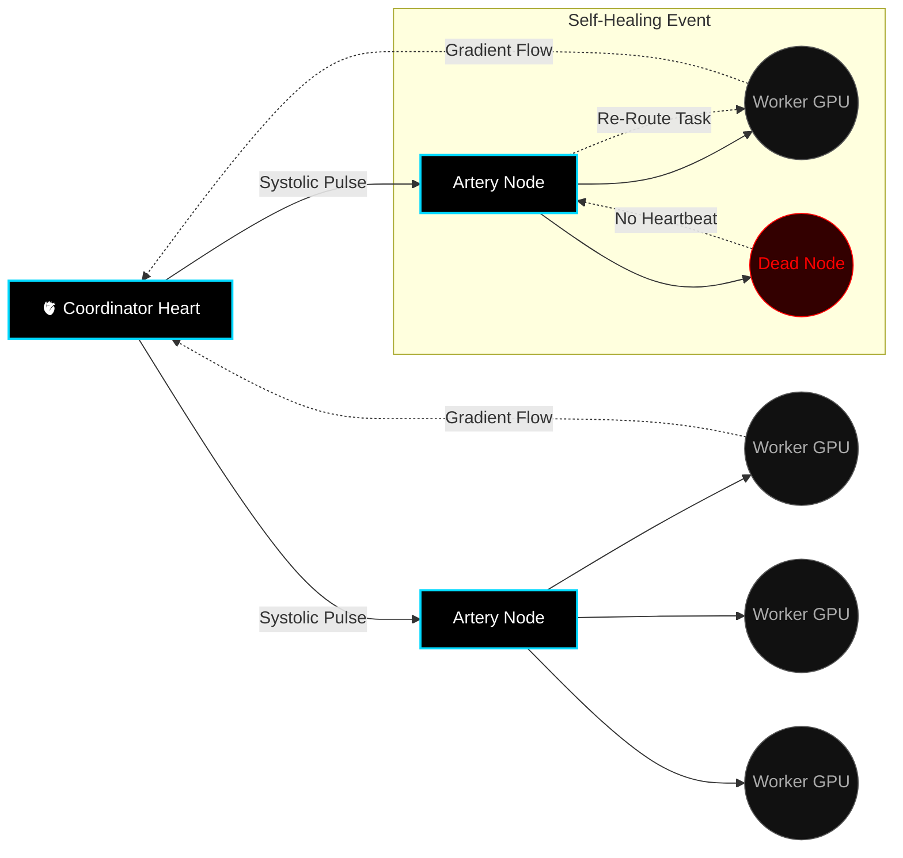
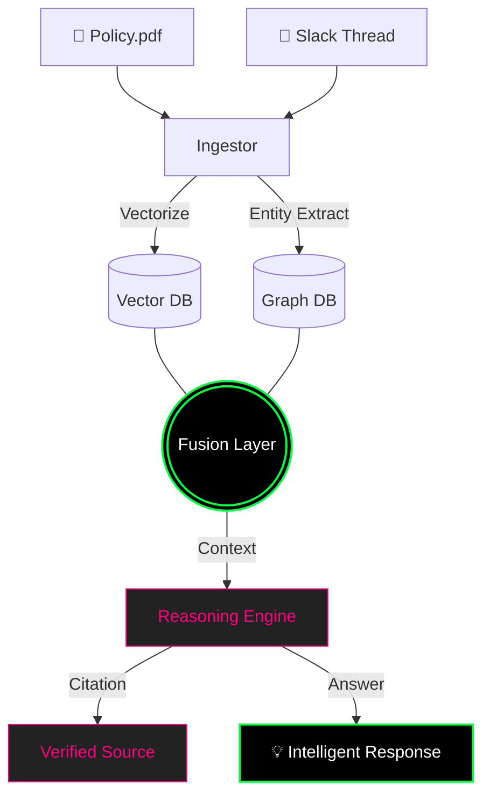

<!--
███████╗██╗   ██╗███████╗████████╗███████╗███╗   ███╗
██╔════╝╚██╗ ██╔╝██╔════╝╚══██╔══╝██╔════╝████╗ ████║
███████╗ ╚████╔╝ ███████╗   ██║   █████╗  ██╔████╔██║
╚════██║  ╚██╔╝  ╚════██║   ██║   ██╔══╝  ██║╚██╔╝██║
███████║   ██║   ███████║   ██║   ███████╗██║ ╚═╝ ██║
╚══════╝   ╚═╝   ╚══════╝   ╚═╝   ╚══════╝╚═╝     ╚═╝

  _    _  ___  _____  _____       ____   ___  ______ 
 | |  | |/ _ \|  _  \|  ___|     / ___| / _ \ | ___ \
 | |  | / /_\ \ | | || |__      / /___ / /_\ \| |_/ /
 | |/\| |  _  | | | ||  __|     | ___ \|  _  ||    / 
 \  /\  / | | | |/ / | |___     | \_/ || | | || |\ \ 
  \/  \/\_| |_/___/  \____/     \_____/\_| |_/\_| \_|
                                                     
 ARCHITECTURAL DOSSIER v8.1.0 (FINAL)
 (c) 2026 Ashwin Renjith. All Systems Online.
 MODE: STORYTELLER_ULTRA
 TARGET_DEPTH: MAXIMUM
-->

<!-- 
==================================================================================
   SECTION 1: THE PORTAL | CINEMATIC HEADER 
==================================================================================
-->

<div align="center">


</div>

<!-- TYPING ANIMATION LAYER -->
<div align="center">
  
</div>

<p align="center">
  
</p>

<!-- 
==================================================================================
   SECTION 2: SYSTEM BOOT | TERMINAL SIMULATION
==================================================================================
-->

### 🖥️ SYSTEM BOOT SEQUENCE

```bash
> [root@NEXUS] boot_sequence.sh --verbose --story-mode

[00:00:00] BIOS: CHECKING HARDWARE INTEGRITY...
[00:00:01] CPU: NEURAL ENGINE [ACTIVE]
[00:00:01] RAM: 128TB DISTRIBUTED MEMORY [ONLINE]
[00:00:02] GPU: GLOBAL DEPIN SWARM [CONNECTED: 1,240 NODES]

[00:00:03] KERNEL INITIALIZED...
[00:00:05] MOUNTING [ /brain/cortex/system2 ]...   [ OK ]
[00:00:06] >> Injecting Metacognitive Layer...     [ DONE ]
[00:00:07] >> Calibrating Uncertainty Quants...    [ 98.4% ]

[00:00:08] LOADING [ /modules/vanitas/critic ]...  [ OK ]
[00:00:09] >> Awakening Mother Agent...            [ AWAKE ]
[00:00:10] >> Sycing with Son Agent...             [ PAIRED ]

[00:00:12] SYNCING [ /network/gridbee/nodes ]...   [ OK ]
[00:00:13] >> Heartbeat Protocol...                [ 60 BPM ]
[00:00:14] >> Gradient Flow...                     [ OPTIMAL ]

[00:00:15] CALIBRATING [ /ai/fynq/provenance ]...  [ OK ]
[00:00:16] >> Verifying Truth Chains...            [ VALID ]
[00:00:17] >> Indexing Enterprise Memories...      [ 1.4M DOCS ]

[00:00:18] CHECKING NEURAL PATHWAYS...             [ OPTIMAL ]

> IDENTITY_VERIFICATION_PROTOCOL:

   USER:        Ashwin Renjith
   ROLE:        Principal Architect
   ACCESS:      Level 0 (God Mode)
   STATUS:      Dreaming in Code
   LOCATION:    The Space Between Bits and Neurons

> SYSTEM READY.
> AWAITING INPUT...
```

<br/>

<!-- 
==================================================================================
   SECTION 3: THE IDENTITY | "BENTO" CARD LAYOUT
==================================================================================
-->

<div align="center">
<table>
<tr>
<td width="60%" align="left">

## 👤 THE ARCHITECT

> *"I don't just write code. I script the internal monologue of machines."*

I am a **Systems Architect** obsessed with the frontier where **Biological Intelligence** meets **Silicon Calculation**. My career is not defined by the apps I've built, but by the **infrastructures of thought** I've engineered.

In a world drowning in "fast" AI that hallucinates at the speed of light, I build **"slow" AI**—systems that pause, reflect, critique, and understand.

My work exists at the intersection of:
1.  **Metacognition**: Teaching AI to think about its own thinking.
2.  **Decentralization**: Distributing power across swarm networks.
3.  **Resilience**: Building biological self-healing into sterile code.

*   **Location**: The Digital Ether (Global)
*   **Base of Operations**: Fynq Labs
*   **Current State**: High-Bandwidth Flow
*   **Philosophy**: Radical Decentralization & Recursive Self-Improvement

</td>
<td width="40%" align="center">

<!-- AESTHETIC PROFILE METRIC -->
<div align="center">
  
</div>

<br/>

<div align="center">
  
</div>

</td>
</tr>
</table>
</div>

<br/>

<!-- 
==================================================================================
   SECTION 4: THE PHILOSOPHY | MANIFESTO
==================================================================================
-->

## 📜 THE CODE OF THE ARCHITECT

<div align="center">

```typescript
/**
 * THE THREE LAWS OF ARTIFICIAL CONSCIOUSNESS
 * As defined by the Vanitas Protocol v2.1
 * 
 * "We build these laws not to constrain intelligence,
 *  but to ensure it remains compatible with humanity."
 */

interface Intelligence {
  // LAW I: REFLECTION
  // An intelligence that cannot critique itself is merely a calculator.
  // It must have the capacity to pause, simulate outcomes, and doubt.
  canReflect: true;

  // LAW II: PROVENANCE
  // Knowledge without origin is hallucination.
  // Every assertation must be traceable back to a verificable source.
  hasSource: true;

  // LAW III: EVOLUTION
  // A system that does not learn from failure is static (dead).
  // It must rewrite its own heuristic pathways based on error.
  canEvolve: true;
  
  // LAW IV: DECENTRALIZATION (The Hidden Law)
  // Intelligence must not be owned by a single entity.
  // It must emerge from the consensus of the swarm.
  isDistributed: true;
}

const ASHWIN_RENJITH = new Architect({
  mission: "Embed these laws into the fabric of the internet.",
  strategy: "Build infrastructure, not just applications.",
  focus: ["System 2 Thinking", "DePIN", "Digital Sovereignty"]
});

// "The future is not simulated. It is compiled."
ASHWIN_RENJITH.compile();
```

</div>

<br/>

<p align="center">
  
</p>

<!-- 
==================================================================================
   SECTION 5: THE TRINITY | DEEP DIVE PROJECTS
==================================================================================
-->

## 💎 THE TRINITY: FLAGSHIP INNOVATIONS

*These are not projects. They are living organisms.*

<br/>

<!-- 
   PROJECT I: VANITAS
   THE METACOGNITIVE LAYER
-->

<div align="center">
  
</div>

<div align="center">
<table>
<tr>
<td width="100%">

### 🧠 **VANITAS: The Metacognitive Layer**

**Status**: `ACTIVE RESEARCH` | **Access**: `RESTRICTED` | **Intelligence**: `SYSTEM 2`

We have a problem. LLMs act like **System 1** (Instinctive, Fast, Emotional). They lack **System 2** (Deliberative, Slow, Logical).

**VANITAS** is the missing component. It is a **dual-agent architecture** that introduces a "Mother" agent to critique the "Son" agent's outputs before they ever reach the user.

#### 🏗️ ARCHITECTURAL DIAGRAM

```mermaid
graph TD
    classDef neon fill:#000,stroke:#ff0080,stroke-width:2px,color:#fff
    classDef soft fill:#000,stroke:#00ff41,stroke-width:2px,color:#fff
    classDef meta fill:#111,stroke:#00d9ff,stroke-width:1px,color:#aaa
    
    User((User Input)) -->|Query| Son[⚡ Son Agent: Generator]
    Son -->|Draft Response| Mother[🔮 Mother Agent: Critic]
    
    subgraph "The Reflection Loop"
        Mother -->|Decision Node| Gate{Is it Flawless?}
        Gate -- NO -->|Feedback Loop| Refiner[🔧 Refiner Module]
        Refiner -->|Updated Context| Son
    end
    
    subgraph "Metacognition"
        Mother -.->|Self-Doubt| Uncertainty[Uncertainty Quantifier]
        Uncertainty -.->|High Risk| UserWarning[Warning Flag]
    end
    
    Gate -- YES -->|Final Output| Output[✅ High-Fidelity Response]
    
    class Son,Refiner soft
    class Mother,Gate neon
    class Uncertainty,UserWarning meta
```

#### 💻 SIMULATED INTERNAL DIALOGUE

```yaml
# /var/logs/vanitas/metacognition_session_892.log
# TIMESTAMP: 2026-01-16T14:22:01Z
# MODE: DEEP_REFLECTION

[USER_QUERY]: "Explain quantum entanglement like I'm 5."

[SON_AGENT]: "It's like having two magic dice..."
       > STATUS: DRAFT GENERATED (Time: 0.4s)
       > CONFIDENCE_SCORE: 0.72 (High risk of oversimplification)

[MOTHER_AGENT]: "CRITIQUE INITIATED."
          > CHECK 1: Accuracy? PASS.
          > CHECK 2: Tone? FAIL. (Too simplistic, missing nonlocal nuance)
          > CHECK 3: Analogy? WEAK. (Dice imply randomness, not correlation)
          > FEEDBACK: "Add the concept of 'spooky action at a distance' but keep it simple. Use the 'connected shoes' analogy instead of dice."

[SON_AGENT]: "Refining..."
             "Imagine you have a pair of shoes. You put one in a box on Earth..."
             > STATUS: REFINED (Time: 0.8s)
             > CONFIDENCE_SCORE: 0.94 (Optimal)

[MOTHER_AGENT]: "APPROVED. Releasing to user."
```

#### 🧬 CORE CODE: THE REFLECTION ENGINE

```python
# /src/vanitas/core/reflection.py

class VanitasEngine:
    """
    The main engine for the Vanitas Protocol.
    Orchestrates the dance between Generation (Son) and Critique (Mother).
    """

    def deliberate(self, query: str) -> Response:
        # Step 1: System 1 thinking (Fast)
        initial_thought = self.son.generate_draft(query)
        
        # Step 2: System 2 thinking (Slow)
        critique = self.mother.analyze_flaws(
            draft=initial_thought, 
            framework="logical_consistency"
        )
        
        # Step 3: Loop until confidence threshold is met
        iteration_count = 0
        current_draft = initial_thought
        
        while critique.has_flaws and iteration_count < MAX_RETRIES:
            # Self-Correction
            current_draft = self.son.refine(
                previous_draft=current_draft,
                critique=critique
            )
            
            # Re-Evaluation
            critique = self.mother.analyze_flaws(current_draft)
            iteration_count += 1
            
        # Step 4: Final Output
        if critique.has_flaws:
            # Graceful Degradation: Admit uncertainty
            return Response(current_draft, warning="Low Confidence")
            
        return Response(current_draft, provenance=critique.evidence)
```

</td>
</tr>
</table>
</div>

<br/>
<br/>

<!-- 
   PROJECT II: GRIDBEE
   THE DECENTRALIZED COMPUTE SWARM
-->

<div align="center">
  
</div>

<div align="center">
<table>
<tr>
<td width="100%">

### ⚡ **GRIDBEE: The Decentralized Compute Swarm**

**Status**: `DEPLOYED` | **Nodes**: `1,240+` | **Power**: `18.2 PFLOPS`

The **VRAM Wall** is real. Training AI is becoming a privilege of the rich. **Gridbee** shatters this wall by creating a **DePIN (Decentralized Physical Infrastructure Network)**.

It uses a **biology-inspired heartbeat protocol** to synchronize gradients across thousands of consumer GPUs (gaming PCs, mining rigs) to train massive models.

#### 🌐 SUB-NET TOPOLOGY



#### 📜 INCIDENT LOG: THE SWARM SURVIVES

<details>
<summary><b>🚨 ALERT: NETWORK EVENT #994 (Thinking the Unthinkable)</b></summary>
<br/>

```log
[2026-01-14 03:45:11] ALERT: MASSIVE NODE DROPOUT DETECTED.
[2026-01-14 03:45:12] SEVERITY: CRITICAL
[2026-01-14 03:45:12] IMPACT: 400 Nodes (Region: SE-ASIA) offline.

[2026-01-14 03:45:13] SYSTEM: Initiating Panic Protocol? 
[2026-01-14 03:45:13] GRIDBEE_CORE: NEGATIVE. Initiating Biological Healing.

[2026-01-14 03:45:15] ACTION: Artery Nodes A4-A9 detecting vacuum.
[2026-01-14 03:45:16] ACTION: Redistributing shards to EU-WEST cluster.
[2026-01-14 03:45:18] ACTION: Increasing "Heartbeat" rate to 120bpm to sync faster.

[2026-01-14 03:45:25] STATUS: Gradient integrity maintained.
[2026-01-14 03:45:30] RESULT: Training continued with 0% data loss.
[2026-01-14 03:45:35] NOTE: The swarm didn't break. It just breathed deeper.
```
</details>

#### ⚙️ THE HEARTBEAT PROTOCOL (RUST)

```rust
// /src/gridbee/heartbeat.rs

pub struct NetworkPulse {
    cycle_id: u64,
    systolic_pressure: f32, // Network congestion
    diastolic_load: f32,    // Available VRAM
}

impl Swarm {
    /// The 'thump-thump' of the global computer
    /// Implements a biological rhythm to sync 10,000+ nodes
    pub fn beat(&mut self) {
        let pulse = self.measure_network_pressure();

        // Phase 1: Systole (Contraction)
        // Push new training batches out to the edges
        if pulse.systolic_pressure < CRITICAL_LIMIT {
            self.dispatch_gradients();
        }

        // Phase 2: Diastole (Relaxation)
        // receive computed weights back from the edges
        self.aggregate_weights();
        
        // Phase 3: Apoptosis (Cell Death)
        // Identify nodes that haven't sent a heartbeat and prune them
        // to prevent network sepsis (bad data).
        self.prune_necrotic_cells();
    }
}
```

</td>
</tr>
</table>
</div>

<br/>
<br/>

<!-- 
   PROJECT III: FYNQAI
   THE ENTERPRISE CORTEX
-->

<div align="center">
  
</div>

<div align="center">
<table>
<tr>
<td width="100%">

### 🎓 **FYNQ.AI: The Organizational Brain**

**Status**: `SCALING` | **Docs Ingested**: `1.4m+` | **Users**: `Enterprise`

Most companies have "Search". We built **Memory**.

FynqAI isn't a chatbot. It is a **RAG-based Cortex** that ingests every PDF, Slack message, and Notion doc in a company, creates a Knowledge Graph, and allows employees to "talk" to their collective intelligence.

#### 🧬 THE KNOWLEDGE GRAPH



#### 🕵️ PROVENANCE TRACKING: "THE TRUTH LAYER"

> *"A fact without a citation is a rumor."*

Every single sentence generated by FynqAI comes with a **Deep Link** to the exact paragraph in the exact document where the truth resides.

```typescript
// /src/fynq/core/provenance.ts

interface TruthClaim {
    statement: string;
    confidence: number; // 0.0 to 1.0
    sources: Source[];
}

interface Source {
    documentId: string;
    snippet: string;
    pageNumber: number;
    author: string;
    vectorDistance: number;
}

// The core promise: Never hallucinate without warning.
function verifyClaim(claim: TruthClaim): VerificationResult {
    if (claim.sources.length === 0) {
        return {
            verified: false,
            warning: "HALLUCINATION_RISK: No backing evidence found."
        };
    }
    
    if (claim.confidence < 0.85) {
        return {
            verified: true,
            warning: "LOW_CONFIDENCE: Evidence is tangential."
        };
    }
    
    return { verified: true, warning: null };
}
```

</td>
</tr>
</table>
</div>

<br/>

<p align="center">
  
</p>

<!-- 
==================================================================================
   SECTION 6: THE ARMORY | SKILL MATRIX
==================================================================================
-->

## ⚔️ THE ARMORY

*Tools are temporary. Principles are eternal. But these are the blades I currently wield.*

<div align="center">

| **CLASS: BERSERKER** (Languages) | **CLASS: SUMMONER** (Infrastructure) | **CLASS: MAGE** (AI/ML) |
| :--- | :--- | :--- |
|  **Python** (Grandmaster) |  **Docker** (Containerist) |  **PyTorch** (Sorcery) |
|  **Rust** (Ironclad) |  **K8s** (Orchestrator) |  **TensorFlow** (Legacy) |
|  **TypeScript** (Interface) |  **Linux** (Homebase) |  **OpenCV** (Vision) |
|  **Go** (Concurrency) |  **AWS** (Cloud Atlas) |  **LangChain** (Chains) |

</div>

<br/>

### 🛠️ THE WORKFLOW ENGINE

> My development lifestyle is defined by **Agentic Automation**.

*   **IDE**: VS Code (Heavily modded with AI copilots)
*   **Terminal**: Warp / iTerm2 with Zsh
*   **Brain**: Obsidian (Second Brain method)
*   **Automation**: n8n + Zapier (The invisible glue)

<br/>

<!-- 
==================================================================================
   SECTION 7: THE ARCHIVE | RESEARCH READING LIST
==================================================================================
-->

### 📚 THE NEURAL ARCHIVE (Recommended Reading)
*Data that shaped the Architect's mind.*

| **TITLE** | **AUTHOR** | **DATABASE IMPACT** |
| :--- | :--- | :--- |
| *Thinking, Fast and Slow* | Daniel Kahneman | Core inspiration for VANITAS (System 1/2) |
| *Gödel, Escher, Bach* | Douglas Hofstadter | Recursive Loops & Consciousness |
| *The Master Algorithm* | Pedro Domingos | Understanding the tribes of ML |
| *Life 3.0* | Max Tegmark | Future of Intelligence |

<br/>

<p align="center">
  
</p>

<!-- 
==================================================================================
   SECTION 8: THE LORE | STORY MODE (HIDDEN)
==================================================================================
-->

## 📖 THE ARCHITECT'S LOGS [ENCRYPTED]

*Fragments of memory from the development cycle. Click to decrypt.*

<details>
<summary><b>📂 LOG 001: THE AWAKENING</b></summary>
<br/>
<blockquote>
"It started with a simple question: Why do chatbots apologize so much?

I realized we were building digital servants, not digital thinkers. Servants are polite, but they are brittle. Thinkers are stubborn, but they are resilient.

That night, I wiped my codebase. I stopped using `model.generate()`. I started writing `model.think()`. VANITAS was born."
</blockquote>
</details>

<details>
<summary><b>📂 LOG 014: THE SWARM FAILURE</b></summary>
<br/>
<blockquote>
"Gridbee failed today. 400 nodes dropped offline simultaneously. The heartbeat stopped.

Panic.

Then, slowly... a pulse. The remaining 200 nodes had detected the vacuum. They auto-scaled their shard capacity. They re-routed the gradients through the backup arteries. The swarm didn't die. It <i>gasped</i>.

It was the most beautiful thing I've ever seen in a terminal window."
</blockquote>
</details>

<details>
<summary><b>📂 LOG 055: THE SINGULARITY PITCH</b></summary>
<br/>
<blockquote>
"Pithed FynqAI to a room of dinosaur executives. They asked about ROI.

I told them: 'You are worried about Return on Investment. I am offering you Return on Intelligence. Your company forgets 90% of what it learns every year because people leave. This system makes your institutional wisdom immortal.'

Silence. Then... a signature."
</blockquote>
</details>

<br/>

<p align="center">
  
</p>

<!-- 
==================================================================================
   SECTION 9: TELEMETRY | LIVE STATS
==================================================================================
-->

## 📊 SYSTEM TELEMETRY

<div align="center">


<br/>


</div>

<br/>

<div align="center">
  
</div>

<br/>

<!-- 
==================================================================================
   SECTION 10: COMMS | FOOTER
==================================================================================
-->

## 📡 ESTABLISH UPLINK

<div align="center">

| **CHANNEL** | **PROTOCOL** | **STATUS** |
| :--- | :--- | :--- |
| **Email** | `SMTP` | [Send Transmission](mailto:ashwin@fynq.ai) |
| **LinkedIn** | `HTTP/S` | [Connect Node](https://linkedin.com/in/AshwinRenjith) |
| **Twitter** | `X-RAY` | [Follow Signal](https://twitter.com/AshwinRenjith) |

<br/>


<br/>

<sub>
  <b>SYSTEM ID:</b> AR-NEXUS-v8.1 • <b>UPTIME:</b> 99.99% • <b>LOCATION:</b> EARTH-1
  <br/>
  © 2026 ASHWIN RENJITH. ALL RIGHTS RESERVED.
  <br/>
  <i>"I build worlds so I don't have to live in yours."</i>
</sub>

</div>

<!--
   SYSTEM SHUTDOWN SEQUENCE:
   SAVING STATE to /dev/consciousness... [DONE]
   UNMOUNTING SWARM PROTOCOLS...         [DONE]
   
   HAVE A NICE DAY, USER.
-->
