<!--
███████╗██╗   ██╗███████╗████████╗███████╗███╗   ███╗
██╔════╝╚██╗ ██╔╝██╔════╝╚══██╔══╝██╔════╝████╗ ████║
███████╗ ╚████╔╝ ███████╗   ██║   █████╗  ██╔████╔██║
╚════██║  ╚██╔╝  ╚════██║   ██║   ██╔══╝  ██║╚██╔╝██║
███████║   ██║   ███████║   ██║   ███████╗██║ ╚═╝ ██║
╚══════╝   ╚═╝   ╚══════╝   ╚═╝   ╚══════╝╚═╝     ╚═╝

  _    _  ___  _____  _____       ____   ___  ______ 
 | |  | |/ _ \|  _  \|  ___|     / ___| / _ \ | ___ \
 | |  | / /_\ \ | | || |__      / /___ / /_\ \| |_/ /
 | |/\| |  _  | | | ||  __|     | ___ \|  _  ||    / 
 \  /\  / | | | |/ / | |___     | \_/ || | | || |\ \ 
  \/  \/\_| |_/___/  \____/     \_____/\_| |_/\_| \_|
                                                     
 ARCHITECTURAL DOSSIER v7.0.0
 (c) 2026 Ashwin Renjith. All Systems Online.
-->

<!-- 
==================================================================================
   SECTION 1: THE PORTAL | CINEMATIC HEADER 
==================================================================================
-->

<div align="center">


</div>

<!-- TYPING ANIMATION LAYER -->
<div align="center">
  
</div>

<p align="center">
  
</p>

<!-- 
==================================================================================
   SECTION 2: SYSTEM BOOT | TERMINAL SIMULATION
==================================================================================
-->

### 🖥️ SYSTEM BOOT SEQUENCE

```bash
> [root@NEXUS] boot_sequence.sh --verbose

[00:00:01] KERNEL INITIALIZED...
[00:00:05] MOUNTING [ /brain/cortex/system2 ]...   [ OK ]
[00:00:08] LOADING [ /modules/vanitas/critic ]...  [ OK ]
[00:00:12] SYNCING [ /network/gridbee/nodes ]...   [ OK ]
[00:00:15] CALIBRATING [ /ai/fynq/provenance ]...  [ OK ]
[00:00:18] CHECKING NEURAL PATHWAYS...             [ OPTIMAL ]

> IDENTITY_VERIFICATION_PROTOCOL:

   USER:        Ashwin Renjith
   ROLE:        Principal Architect
   ACCESS:      Level 0 (God Mode)
   STATUS:      Dreaming in Code

> SYSTEM READY.
> AWAITING INPUT...
```

<br/>

<!-- 
==================================================================================
   SECTION 3: THE IDENTITY | "BENTO" CARD LAYOUT
==================================================================================
-->

<div align="center">
<table>
<tr>
<td width="60%" align="left">

## 👤 THE ARCHITECT

> *"I don't just write code. I script the internal monologue of machines."*

I am a **Systems Architect** obsessed with the frontier where **Biological Intelligence** meets **Silicon Calculation**. My career is not defined by the apps I've built, but by the **infrastructures of thought** I've engineered.

In a world drowning in "fast" AI that hallucinates at the speed of light, I build **"slow" AI**—systems that pause, reflect, critique, and understand.

*   **Location**: The Digital Ether (Global)
*   **Base of Operations**: Fynq Labs
*   **Current State**: High-Bandwidth Flow
*   **Philosophy**: Radical Decentralization & Recursive Self-Improvement

</td>
<td width="40%" align="center">

<!-- AESTHETIC PROFILE METRIC -->
<div align="center">
  
</div>

</td>
</tr>
</table>
</div>

<br/>

<!-- 
==================================================================================
   SECTION 4: THE PHILOSOPHY | MANIFESTO
==================================================================================
-->

## 📜 THE CODE OF THE ARCHITECT

<div align="center">

```typescript
/**
 * THE THREE LAWS OF ARTIFICIAL CONSCIOUSNESS
 * As defined by the Vanitas Protocol
 */

interface Intelligence {
  // LAW I: REFLECTION
  // An intelligence that cannot critique itself is merely a calculator.
  canReflect: true;

  // LAW II: PROVENANCE
  // Knowledge without origin is hallucination.
  hasSource: true;

  // LAW III: EVOLUTION
  // A system that does not learn from failure is static (dead).
  canEvolve: true;
}

const ASHWIN_RENJITH = new Architect({
  mission: "Embed these laws into the fabric of the internet.",
  strategy: "Build infrastructure, not just applications."
});
```

</div>

<br/>

<p align="center">
  
</p>

<!-- 
==================================================================================
   SECTION 5: THE TRINITY | DEEP DIVE PROJECTS
==================================================================================
-->

## 💎 THE TRINITY: FLAGSHIP INNOVATIONS

*These are not projects. They are living organisms.*

<br/>

<!-- 
   PROJECT I: VANITAS
-->

<div align="center">
  
</div>

<div align="center">
<table>
<tr>
<td width="100%">

### 🧠 **VANITAS: The Metacognitive Layer**

**Status**: `ACTIVE RESEARCH` | **Access**: `RESTRICTED`

We have a problem. LLMs act like **System 1** (Instinctive, Fast, Emotional). They lack **System 2** (Deliberative, Slow, Logical).

**VANITAS** is the missing component. It is a **dual-agent architecture** that introduces a "Mother" agent to critique the "Son" agent's outputs before they ever reach the user.

#### 🏗️ ARCHITECTURAL DIAGRAM

```mermaid
graph TD
    classDef neon fill:#000,stroke:#ff0080,stroke-width:2px,color:#fff
    classDef soft fill:#000,stroke:#00ff41,stroke-width:2px,color:#fff
    
    User((User Input)) -->|Query| Son[⚡ Son Agent: Generator]
    Son -->|Draft Response| Mother[🔮 Mother Agent: Critic]
    
    Mother -->|Decision Node| Gate{Is it Flawless?}
    
    Gate -- NO -->|Feedback Loop| Refiner[🔧 Refiner Module]
    Refiner -->|Updated Context| Son
    
    Gate -- YES -->|Final Output| Output[✅ High-Fidelity Response]
    
    class Son,Refiner soft
    class Mother,Gate neon
```

#### 💻 SIMULATED INTERNAL DIALOGUE

```yaml
# /var/logs/vanitas_session_892.log

[USER]: "Explain quantum entanglement like I'm 5."

[SON]: "It's like having two magic dice..."
       > STATUS: DRAFT GENERATED (Time: 0.4s)

[MOTHER]: "CRITIQUE INITIATED."
          > CHECK 1: Accuracy? PASS.
          > CHECK 2: Tone? FAIL. (Too simplistic, missing nonlocal nuance)
          > FEEDBACK: "Add the concept of 'spooky action at a distance' but keep it simple."

[SON]: "Refining..."
       "Imagine two magic dice. No matter how far apart they are..."
       > STATUS: REFINED (Time: 0.8s)

[MOTHER]: "APPROVED."
```

</td>
</tr>
</table>
</div>

<br/>
<br/>

<!-- 
   PROJECT II: GRIDBEE
-->

<div align="center">
  
</div>

<div align="center">
<table>
<tr>
<td width="100%">

### ⚡ **GRIDBEE: The Decentralized Compute Swarm**

**Status**: `DEPLOYED` | **Nodes**: `1,240+`

The **VRAM Wall** is real. Training AI is becoming a privilege of the rich. **Gridbee** shatters this wall by creating a **DePIN (Decentralized Physical Infrastructure Network)**.

It uses a **biology-inspired heartbeat protocol** to synchronize gradients across thousands of consumer GPUs (gaming PCs, mining rigs) to train massive models.

#### 🌐 SUB-NET TOPOLOGY

```mermaid
graph LR
    classDef core fill:#000,stroke:#00d9ff,stroke-width:2px,color:#fff
    classDef node fill:#111,stroke:#555,stroke-width:1px,color:#aaa
    
    Heart[🫀 Coordinator Heart] -->|Systolic Pulse| A1[Artery Node]
    Heart -->|Systolic Pulse| A2[Artery Node]
    
    A1 --> C1((Worker GPU))
    A1 --> C2((Worker GPU))
    A1 --> C3((Worker GPU))
    
    A2 --> C4((Worker GPU))
    A2 --> C5((Worker GPU))
    
    C1 -.->|Gradient Flow| Heart
    C4 -.->|Gradient Flow| Heart

    class Heart,A1,A2 core
    class C1,C2,C3,C4,C5 node
```



#### ⚙️ THE HEARTBEAT PROTOCOL (RUST)

```rust
// /src/gridbee/heartbeat.rs

pub struct NetworkPulse {
    cycle_id: u64,
    systolic_pressure: f32, // Network congestion
    diastolic_load: f32,    // Available VRAM
}

impl Swarm {
    /// The 'thump-thump' of the global computer
    pub fn beat(&mut self) {
        // 1. Contract: Send tasks out (Systole)
        self.dispatch_gradients();
        
        // 2. Relax: Gather results (Diastole)
        self.aggregate_weights();
        
        // 3. Heal: Check for dead nodes
        self.prune_necrotic_cells();
    }
}
```

</td>
</tr>
</table>
</div>

<br/>
<br/>

<!-- 
   PROJECT III: FYNQAI
-->

<div align="center">
  
</div>

<div align="center">
<table>
<tr>
<td width="100%">

### 🎓 **FYNQ.AI: The Organizational Brain**

**Status**: `SCALING` | **Docs Ingested**: `1.4m+`

Most companies have "Search". We built **Memory**.

FynqAI isn't a chatbot. It is a **RAG-based Cortex** that ingests every PDF, Slack message, and Notion doc in a company, creates a Knowledge Graph, and allows employees to "talk" to their collective intelligence.

#### 🧬 THE KNOWLEDGE GRAPH

```mermaid
graph TD
    classDef doc fill:#000,stroke:#fff,stroke-width:1px,color:#fff
    classDef memory fill:#000,stroke:#00ff41,stroke-width:2px,color:#fff

    Input[📄 Policy.pdf] --> Ingestor
    Input2[💬 Slack Thread] --> Ingestor
    
    Ingestor -->|Vectorize| Pinecone[(Vector DB)]
    Ingestor -->|Entity Extract| Graph[(Graph DB)]
    
    Pinecone --- Link(((Fusion Layer)))
    Graph --- Link
    
    Link -->|Context| Answer[💡 Intelligent Response]
    
    class Link,Answer memory
```



#### 🕵️ PROVENANCE TRACKING

> *"A fact without a citation is a rumor."*

Every single sentence generated by FynqAI comes with a **Deep Link** to the exact paragraph in the exact document where the truth resides.

</td>
</tr>
</table>
</div>

<br/>

<p align="center">
  
</p>

<!-- 
==================================================================================
   SECTION 6: THE ARMORY | SKILL MATRIX
==================================================================================
-->

## ⚔️ THE ARMORY

*Tools are temporary. Principles are eternal. But these are the blades I currently wield.*

<div align="center">

| **CLASS: BERSERKER** (Languages) | **CLASS: SUMMONER** (Infrastructure) | **CLASS: MAGE** (AI/ML) |
| :--- | :--- | :--- |
|  **Python** (Grandmaster) |  **Docker** (Containerist) |  **PyTorch** (Sorcery) |
|  **Rust** (Ironclad) |  **K8s** (Orchestrator) |  **TensorFlow** (Legacy) |
|  **TypeScript** (Interface) |  **Linux** (Homebase) |  **OpenCV** (Vision) |
|  **Go** (Concurrency) |  **AWS** (Cloud Atlas) |  **LangChain** (Chains) |

</div>

<br/>

### 🛠️ THE WORKFLOW ENGINE

> My development lifestyle is defined by **Agentic Automation**.

*   **IDE**: VS Code (Heavily modded with AI copilots)
*   **Terminal**: Warp / iTerm2 with Zsh
*   **Brain**: Obsidian (Second Brain method)
*   **Automation**: n8n + Zapier (The invisible glue)

<br/>

<p align="center">
  
</p>

<!-- 
==================================================================================
   SECTION 7: THE LORE | STORY MODE (HIDDEN)
==================================================================================
-->

## 📖 THE ARCHITECT'S LOGS [ENCRYPTED]

*Fragments of memory from the development cycle. Click to decrypt.*

<details>
<summary><b>📂 LOG 001: THE AWAKENING</b></summary>
<br/>
<blockquote>
"It started with a simple question: Why do chatbots apologize so much?

I realized we were building digital servants, not digital thinkers. Servants are polite, but they are brittle. Thinkers are stubborn, but they are resilient.

That night, I wiped my codebase. I stopped using `model.generate()`. I started writing `model.think()`. VANITAS was born."
</blockquote>
</details>

<details>
<summary><b>📂 LOG 014: THE SWARM FAILURE</b></summary>
<br/>
<blockquote>
"Gridbee failed today. 400 nodes dropped offline simultaneously. The heartbeat stopped.

Panic.

Then, slowly... a pulse. The remaining 200 nodes had detected the vacuum. They auto-scaled their shard capacity. They re-routed the gradients through the backup arteries. The swarm didn't die. It <i>gasped</i>.

It was the most beautiful thing I've ever seen in a terminal window."
</blockquote>
</details>

<details>
<summary><b>📂 LOG 055: THE SINGULARITY PITCH</b></summary>
<br/>
<blockquote>
"Pithed FynqAI to a room of dinosaur executives. They asked about ROI.

I told them: 'You are worried about Return on Investment. I am offering you Return on Intelligence. Your company forgets 90% of what it learns every year because people leave. This system makes your institutional wisdom immortal.'

Silence. Then... a signature."
</blockquote>
</details>

<br/>

<p align="center">
  
</p>

<!-- 
==================================================================================
   SECTION 8: TELEMETRY | LIVE STATS
==================================================================================
-->

## 📊 SYSTEM TELEMETRY

<div align="center">


<br/>


</div>

<br/>

<div align="center">
  
</div>

<br/>

<!-- 
==================================================================================
   SECTION 9: COMMS | FOOTER
==================================================================================
-->

## 📡 ESTABLISH UPLINK

<div align="center">

| **CHANNEL** | **PROTOCOL** | **STATUS** |
| :--- | :--- | :--- |
| **Email** | `SMTP` | [Send Transmission](mailto:ashwin@fynq.ai) |
| **LinkedIn** | `HTTP/S` | [Connect Node](https://linkedin.com/in/AshwinRenjith) |
| **Twitter** | `X-RAY` | [Follow Signal](https://twitter.com/AshwinRenjith) |

<br/>


<br/>

<sub>
  <b>SYSTEM ID:</b> AR-NEXUS-v7 • <b>UPTIME:</b> 99.99% • <b>LOCATION:</b> EARTH-1
  <br/>
  © 2026 ASHWIN RENJITH. ALL RIGHTS RESERVED.
  <br/>
  <i>"I build worlds so I don't have to live in yours."</i>
</sub>

</div>

<!--
   END OF FILE
   TERMINATING SESSION...
   [████████████████████] 100%
   GOODBYE.
-->
