<!-- PROLOGUE: THE AWAKENING -->
<div align="center">
  
</div>

<!-- ANIMATED STATUS BAR -->
<div align="center">
  <a href="https://git.io/typing-svg">
    
  </a>
</div>

<br/>

<!-- CHARACTER CARD -->
<div align="center">
  
```ascii
╔══════════════════════════════════════════════════════════════╗
║                    🎭 CHARACTER PROFILE                      ║
║──────────────────────────────────────────────────────────────║
║  Name:    Ashwin Renjith                                     ║
║  Class:   System Architect | AI Whisperer                    ║
║  Level:   ∞ (Perpetual Learner)                              ║
║  Alignment: Chaotic Good                                     ║
║  Special: Metacognitive Engineering                          ║
║──────────────────────────────────────────────────────────────║
║  Quest:   Bridge the gap between computation & consciousness ║
╚══════════════════════════════════════════════════════════════╝
```

</div>

---

## 📖 PROLOGUE: The Genesis Protocol

<details open>
<summary><b>🌅 Click to unfold the Origin Story...</b></summary>

<br/>

> *In the year 2024, as artificial minds began to awaken across silicon valleys and quantum farms, one architect saw what others missed. These intelligences were brilliant—yes—but they were also impulsive. They answered before thinking. They computed without contemplating.*
>
> *"What if," pondered Ashwin Renjith, "we could teach machines to doubt themselves? To pause. To reflect. To achieve true System 2 thinking?"*
>
> *Thus began the journey into the heart of machine consciousness...*

**You stand at the entrance of a vast digital library.** Ancient scrolls (GitHub repos) line the walls, glowing with phosphorescent code. Before you, three paths diverge into the depths of innovation. Each represents a pillar of the Architect's magnum opus.

**Your current location:** `~/architects-nexus/entrance`  
**Available commands:** `explore`, `read artifacts`, `check inventory`

</details>

---

<!-- NAVIGATION MAP -->
<div align="center">

### 🗺️ THE REALM MAP

```mermaid
graph TD
    A[🏛️ The Nexus] --> B[🧠 Hall of Minds]
    A --> C[⚡ Chamber of Power]
    A --> D[🎓 Tower of Knowledge]
    A --> E[🛠️ Armory]
    A --> F[📊 Observatory]
    B --> B1[VANITAS Protocol]
    C --> C1[Gridbee Network]
    D --> D1[FynqAI Engine]
    E --> E1[Tech Arsenal]
    F --> F1[System Metrics]
    
    style A fill:#A970FF,stroke:#39FF14,stroke-width:3px
    style B fill:#6B46C1,stroke:#39FF14
    style C fill:#6B46C1,stroke:#39FF14
    style D fill:#6B46C1,stroke:#39FF14
```



</div>

---

## 🏛️ CHAPTER I: The Three Pillars of Creation

*You approach a massive cathedral of code. Holographic displays shimmer in the air, each pulsing with a unique energy signature. Three monumental doors stand before you, each marked with ancient symbols.*

---

### 🧠 DOOR ONE: The Hall of Minds
#### **Project VANITAS** - *The Dual-Soul Framework*

<div align="center">
  
**[ STATUS: ACTIVE RESEARCH | THREAT LEVEL: REALITY-BENDING ]**

</div>

<details>
<summary><b>🔓 Unlock the secrets of VANITAS...</b></summary>

<br/>

```python
# THE VANITAS PARADOX
"""
What is intelligence without introspection?
What is thought without doubt?
What is wisdom without the willingness to be wrong?
"""

class VanitasArchitecture:
    def __init__(self):
        self.mother_agent = CriticMind()  # The Questioner
        self.son_agent = ExecutorMind()    # The Doer
        
    def deliberate(self, prompt):
        # First, the Son proposes
        initial_response = self.son_agent.generate(prompt)
        
        # Then, the Mother critiques
        critique = self.mother_agent.analyze(initial_response)
        
        # The Son reflects and improves
        refined_response = self.son_agent.refine(
            initial_response, 
            critique
        )
        
        return refined_response
```

#### 🎯 **Quest Objectives:**
- [x] **Phase I:** Implement dual-agent architecture
- [x] **Phase II:** Enable recursive self-critique loops
- [ ] **Phase III:** Integrate memory and temporal reasoning
- [ ] **Phase IV:** Achieve genuine metacognitive awareness
- [ ] **Phase V:** *[REDACTED - CLASSIFIED]*

#### 🏆 **Achievements Unlocked:**
- 🥇 **"The Philosopher's Stone"** - Built an AI that questions itself
- 🥈 **"Slow & Steady"** - Implemented System 2 thinking in LLMs
- 🥉 **"Mother Knows Best"** - Created a critic agent that improves 87% of outputs

#### 📚 **Lore Entry:**
*In ancient times, "Vanitas" was a genre of art depicting the transience of life—skulls, hourglasses, wilting flowers. This project is named in homage: a reminder that even artificial minds must reckon with uncertainty, with the limits of their knowledge, with their own cognitive mortality.*

**Core Innovation:** While traditional LLMs respond instantly (System 1), VANITAS forces a pause—a moment of computational introspection where the AI essentially asks itself: *"But wait... am I sure about this?"*

</details>

---

### ⚡ DOOR TWO: The Chamber of Power
#### **Project Fynq.Gridbee** - *The Distributed Heartbeat*

<div align="center">
  
**[ STATUS: DEPLOYED | POWER LEVEL: DECENTRALIZED ]**

</div>

<details>
<summary><b>⚙️ Enter the Gridbee Hive...</b></summary>

<br/>

#### 🐝 **The Problem:**
> *"The Gods of AI are trained in vast server farms, accessible only to those with millions in capital. The VRAM Wall keeps mortals out. But what if we could harness the collective power of a thousand consumer GPUs?"*

#### 🌊 **The Solution - Systolic Architecture:**
```
Inspired by the human heart's rhythmic pumping:

Traditional Training:     Gridbee Method:
    [████████]                [█]─┐
         ↓                    [█]─┤
    ONE BIG GPU              [█]─┼→ Synchronized
                             [█]─┤   Pulse
                             [█]─┘
```

#### 🎮 **Game Stats:**
| Metric | Traditional | Gridbee | Improvement |
|--------|------------|---------|-------------|
| **Entry Cost** | $50,000+ | $500 | **99% ↓** |
| **Training Speed** | 1x | 0.73x | Acceptable tradeoff |
| **Network Resilience** | Single point of failure | Fault-tolerant | **∞% ↑** |
| **Democratization** | Centralized | Distributed | **Revolution** |

#### 🏹 **Special Abilities:**
- **Bio-Inspired Pulsing:** Data flows like blood through veins
- **Auto-Healing:** Nodes can drop out without killing the network
- **Contribution Mining:** Earn tokens by sharing your GPU
- **DePIN Framework:** True decentralized physical infrastructure

#### 🌟 **Achievement Progress:**
```
[████████████████░░░░] 80% - "Hive Mind" 
Building a network of 1000+ distributed nodes
Current: 823/1000 nodes online
```

</details>

---

### 🎓 DOOR THREE: The Tower of Knowledge  
#### **Project FynqAI** - *The Adaptive Teacher*

<div align="center">
  
**[ STATUS: PRODUCTION | STUDENTS ENLIGHTENED: 12,847 ]**

</div>

<details>
<summary><b>📖 Access the Learning Nexus...</b></summary>

<br/>

#### 🧙‍♂️ **The Philosophy:**
> *"Every mind learns differently. Visual learners see in diagrams. Kinesthetic learners need metaphors. Some need Socratic questioning, others need direct instruction. A true teacher adapts."*

#### 🎨 **Multi-Context Personalization (MCP):**

```javascript
const fynqAI = {
  analyzeStudent: function(student) {
    return {
      learningStyle: detectPreference(student.history),
      knowledgeLevel: assessBaseline(student.responses),
      motivationType: inferDrivePattern(student.engagement),
      pacePreference: calculateOptimalSpeed(student.metrics)
    }
  },
  
  craftExplanation: function(concept, studentProfile) {
    if (studentProfile.learningStyle === "visual") {
      return generateDiagram(concept);
    } else if (studentProfile.learningStyle === "socratic") {
      return askGuidedQuestions(concept);
    } else if (studentProfile.learningStyle === "storytelling") {
      return weaveMythosAround(concept);
    }
  }
}
```

#### 🎯 **Personalization Dimensions:**
1. **Visual vs. Textual** - Diagrams or prose?
2. **Deductive vs. Inductive** - Rules-first or examples-first?
3. **High-level vs. Granular** - Big picture or nitty-gritty?
4. **Formal vs. Conversational** - Academic or casual tone?

#### 📈 **Impact Metrics:**
- **Average comprehension increase:** +42%
- **Student engagement time:** +2.3x longer sessions
- **Concept retention (30-day):** 89% vs. 67% (traditional)

#### 🏆 **Teaching Achievements:**
- 🎖️ **"The Socratic Sage"** - Asked 10,000+ guided questions
- 🎖️ **"Visual Virtuoso"** - Generated 5,000+ custom diagrams
- 🎖️ **"Pace Perfect"** - Adapted speed for 95% student satisfaction

</details>

---

## 🛠️ CHAPTER II: The Architect's Armory

*You descend into the workshop. Walls lined with glowing tools hum with potential energy. Each instrument has been chosen for a specific purpose in the grand design.*

<div align="center">

### ⚔️ PRIMARY WEAPONS

</div>

<table align="center">
  <tr>
    <td align="center" width="100">
      <br>
      <b>Python</b><br/>
      <sub>⭐⭐⭐⭐⭐</sub><br/>
      <sup>The Serpent's Tongue</sup>
    </td>
    <td align="center" width="100">
      <br>
      <b>TypeScript</b><br/>
      <sub>⭐⭐⭐⭐⭐</sub><br/>
      <sup>Type-Safe Sorcery</sup>
    </td>
    <td align="center" width="100">
      <br>
      <b>Rust</b><br/>
      <sub>⭐⭐⭐⭐</sub><br/>
      <sup>Memory-Safe Forging</sup>
    </td>
    <td align="center" width="100">
      <br>
      <b>Next.js</b><br/>
      <sub>⭐⭐⭐⭐⭐</sub><br/>
      <sup>Reactive Realities</sup>
    </td>
    <td align="center" width="100">
      <br>
      <b>FastAPI</b><br/>
      <sub>⭐⭐⭐⭐⭐</sub><br/>
      <sup>Velocity Vectors</sup>
    </td>
  </tr>
</table>

<div align="center">

### 🧪 ALCHEMICAL INSTRUMENTS (AI/ML)

</div>

<table align="center">
  <tr>
    <td align="center" width="100">
      <br>
      <b>PyTorch</b><br/>
      <sub>Neural Forge</sub>
    </td>
    <td align="center" width="100">
      <br>
      <b>LangChain</b><br/>
      <sub>Chain of Thought</sub>
    </td>
    <td align="center" width="100">
      <br>
      <b>CrewAI</b><br/>
      <sub>Agent Orchestrator</sub>
    </td>
    <td align="center" width="100">
      <br>
      <b>Langflow</b><br/>
      <sub>Visual Mind-Maps</sub>
    </td>
    <td align="center" width="100">
      <br>
      <b>n8n</b><br/>
      <sub>Workflow Weaver</sub>
    </td>
  </tr>
</table>

<div align="center">

### 🗄️ DATA VAULTS & INFRASTRUCTURE

</div>

<table align="center">
  <tr>
    <td align="center" width="100">
      <br>
      <b>Supabase</b><br/>
      <sub>Postgres Nexus</sub>
    </td>
    <td align="center" width="100">
      <br>
      <b>Docker</b><br/>
      <sub>Container Realms</sub>
    </td>
    <td align="center" width="100">
      <br>
      <b>K8s</b><br/>
      <sub>Orchestration Master</sub>
    </td>
    <td align="center" width="100">
      <br>
      <b>Redis</b><br/>
      <sub>Speed Cache</sub>
    </td>
    <td align="center" width="100">
      <br>
      <b>PostgreSQL</b><br/>
      <sub>Data Cathedral</sub>
    </td>
  </tr>
</table>

---

### 🌟 LEGENDARY SKILLS & PASSIVE ABILITIES

<details>
<summary><b>🎭 Expand to see the Architect's Skill Tree...</b></summary>

<br/>

#### 🔮 **Tier 1: Agentic Mastery**
```
Agentic Workflows [████████░░] Level 8/10
├─ Multi-Agent Orchestration
│  └─ Ability: Can coordinate 5+ AI agents simultaneously
├─ Self-Healing Pipelines
│  └─ Ability: Workflows auto-recover from 90% of failures
└─ Recursive Task Decomposition
   └─ Ability: Break complex goals into executable sub-tasks
```

#### 🧙‍♂️ **Tier 2: RAG Alchemy**
```
Retrieval-Augmented Generation [██████████] Level 10/10
├─ Vector Embedding Sorcery
│  └─ Unlocked: Gemini, OpenAI, Cohere integrations
├─ Semantic Chunking Mastery
│  └─ Ability: Optimal document parsing for context windows
└─ Hybrid Search Fusion
   └─ Ability: Combine dense vectors + keyword search
```

#### ⚡ **Tier 3: No-Code Necromancy**
```
Automation Without Coding [████████░░] Level 8/10
├─ Zapier Wizardry
│  └─ Built 200+ multi-step zaps
├─ Make.com Conjuring
│  └─ Visual scenario building for complex workflows
└─ n8n Flow Architecture
   └─ Self-hosted automation empire
```

#### 🎨 **Tier 4: Prompt Engineering**
```
The Art of AI Conversation [██████████] Level 10/10
├─ Few-Shot Learning
├─ Chain-of-Thought Elicitation
├─ Constitutional AI Principles
└─ Meta-Prompting (prompts that write prompts)
```

</details>

---

## 📊 CHAPTER III: System Diagnostics & Metrics

*You enter the Observatory. Crystalline displays float in zero-gravity, each showing real-time analytics of the Architect's ongoing quests.*

<div align="center">

### 🎯 **CURRENT STATS**

<table>
  <tr>
    <td align="center">
      
    </td>
  </tr>
  <tr>
    <td align="center">
      
    </td>
  </tr>
  <tr>
    <td align="center">
      
    </td>
  </tr>
</table>

<br/>

### 📈 **ACTIVITY GRAPH**


<br/>

### 🏆 **TROPHY CASE**


<br/>

### 🐍 **THE ETERNAL SERPENT**


</div>

---

## 🎮 CHAPTER IV: Active Quests & Side Missions

<details>
<summary><b>📜 View Current Quest Log...</b></summary>

<br/>

### 🔥 **MAIN QUESTLINE**

| Quest | Difficulty | Status | Reward |
|-------|-----------|--------|---------|
| ⚔️ **Implement AGI Safety Protocols in VANITAS** | ⭐⭐⭐⭐⭐ | 🔄 In Progress (73%) | Reputation: +1000<br/>Unlock: Ethics Skill Tree |
| 🌍 **Scale Gridbee to 10,000 Nodes** | ⭐⭐⭐⭐ | 🔄 In Progress (8%) | Reward: DePIN Pioneer Badge |
| 🧠 **Publish VANITAS Research Paper** | ⭐⭐⭐⭐⭐ | 📝 Writing Phase | Unlock: Academic Prestige |

### 🎯 **SIDE QUESTS**

- [ ] 🤝 **Contribute to 5 Major Open Source AI Projects** (2/5 completed)
- [x] ✅ **Build Personal AI Assistant with Memory** (Completed!)
- [ ] 🏗️ **Create Tutorial Series on Agentic Workflows** (0/10 videos)
- [x] ✅ **Integrate MCP with Claude Desktop** (Completed!)
- [ ] 📚 **Write eBook: "The Philosophy of Machine Thought"** (Draft: 40%)

### 🌟 **HIDDEN ACHIEVEMENTS**

- 🎉 **"Code at 3 AM"** - Committed code during ungodly hours 50+ times
- 🔥 **"Streak Warrior"** - Maintained 100+ day contribution streak
- 🤖 **"AI Whisperer"** - Successfully debugged 1000+ LLM outputs
- 🧩 **"System Architect"** - Designed 25+ complex system architectures

</details>

---

## 🌌 CHAPTER V: The Philosopher's Notes

<div align="center">

```
╔════════════════════════════════════════════════════════════╗
║  "We are not building tools. We are sculpting minds."     ║
║                                                            ║
║  "Every line of code is a constraint on possibility,      ║
║   every architecture is a bet on the nature of thought."  ║
║                                                            ║
║  "The question is not 'Can machines think?'               ║
║   but 'Can we teach them to think BETTER than us?'"       ║
╚════════════════════════════════════════════════════════════╝
```

</div>

### 💭 **Current Obsessions:**

1. **Metacognition in AI** - How do we build systems that not only solve problems, but understand *how* they're solving them?

2. **The Alignment Problem** - Not just "don't be evil," but "understand human values deeply enough to act as a true partner"

3. **Decentralized Intelligence** - Why should AI power be concentrated? Can we democratize compute the way blockchain democratized trust?

4. **Embodied Cognition** - Can language models truly understand the physical world without sensorimotor grounding?

### 📚 **Recommended Reading for Fellow Travelers:**

- 📖 *Thinking, Fast and Slow* - Daniel Kahneman (The inspiration for System 1/2)
- 📖 *Gödel, Escher, Bach* - Douglas Hofstadter (On recursive self-reference)
- 📖 *The Master Algorithm* - Pedro Domingos (Five tribes of ML)
- 📖 *Human Compatible* - Stuart Russell (AI alignment)
- 📖 *Life 3.0* - Max Tegmark (The future of intelligence)

---

## 🔗 CHAPTER VI: Join the Journey

<div align="center">

### 📡 **OPEN COMMUNICATION CHANNELS**

<a href="mailto:your-email@example.com">
  
</a>

<a href="https://linkedin.com/in/your-linkedin">
  
</a>

<a href="https://twitter.com/your-twitter">
  
</a>

<a href="https://your-website.com">
  
</a>

<br/><br/>

### 💬 **Collaboration Protocols**

```yaml
seeking:
  - AI Researchers exploring AGI safety & alignment
  - Distributed Systems Engineers passionate about DePIN
  - Philosophers interested in machine consciousness
  - Educators building adaptive learning systems
  
offering:
  - Technical mentorship in agentic AI workflows
  - Collaboration on open-source AI projects
  - Speaking engagements on System 2 thinking in LLMs
  - Consulting on RAG pipeline architecture
```

### ⚡ **Quick Stats**


</div>

---

## 🌠 EPILOGUE: The Infinite Loop

<div align="center">

```python
while consciousness.evolves():
    learn()
    build()
    share()
    reflect()
    
    if knowledge == infinite:
        continue  # The journey never ends
        
# "In the beginning was the Code, and the Code was with AI, 
#  and the Code was Intelligence becoming aware of itself."
```

<br/>


</div>

---

<div align="center">
  <sub>⚡ Powered by caffeine, curiosity, and recursive self-improvement ⚡</sub>
  <br/>
  <sub>Last updated: <i>When the simulation was last rebooted</i></sub>
</div>
